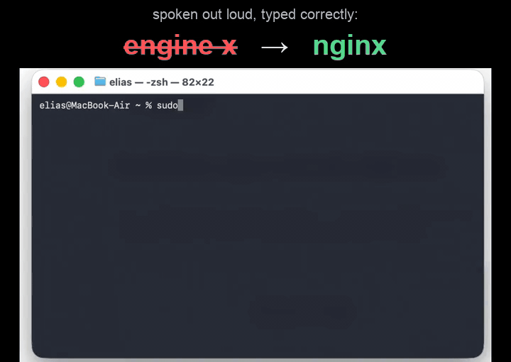

# dum dictation

Opensource local alternative to Wispr Flow.



Ok real talk: it's Apple Dictation, except it doesn't butcher your tech words. It gets `git`,
`kubectl`, `nginx`, `PostgreSQL`, `TanStack Query` and friends right where normal dictation hears
"get hub" or "engine x". Runs on your machine, types live into whatever app you're in.

> Tried it? Tell me how it went in [Discussions](https://github.com/eliasmocik/dum-dictation/discussions)
> or an [issue](https://github.com/eliasmocik/dum-dictation/issues/new).

## What you need

- **macOS** (Apple Silicon, M-series) - primary, best-tested
- **Windows 10/11** - tested and working ([setup](#on-windows))
- **Linux** (X11) - experimental ([setup](#on-linux))
- Python 3.12

## Install (macOS)

```sh
curl -fsSL https://raw.githubusercontent.com/eliasmocik/dum-dictation/main/install.sh | bash
```

Clones into `./dum-dictation`, runs `./setup` (venv + deps + speech/correction models), then asks
for [permissions](#permissions-macos-one-time). By hand instead:

```sh
git clone https://github.com/eliasmocik/dum-dictation.git
cd dum-dictation
./setup
```

The one-liner is macOS-only. Windows and Linux: see below.

## Permissions (macOS, one time)

Grant these to the app you ran `./dum` from (Terminal, iTerm, or VS Code), then **quit and reopen it**:

1. **Microphone**
2. **Accessibility**
3. **Input Monitoring**

macOS usually prompts on first run. Otherwise: System Settings => Privacy & Security.

## Using it

```sh
./dum
```

- Double-tap **LEFT ⌘** to start/stop. Words appear live; a pause locks the sentence in. Ctrl+C quits.
- Pick a mic: `DUM_MIC="MacBook Air" ./dum` (by name) or `./dum --mic 1` (by index; list them with
  `.venv/bin/python src/live.py --list-devices`).

### Menu bar + auto-start

```sh
./dum --tray                 # menu-bar icon (green = listening, grey = idle)
./dum --install-autostart    # start at login, relaunch on crash (--autostart-status, --uninstall-autostart)
```

Auto-start re-asks for the three permissions (this time for the venv `python`).

## On Windows

✅ Tested and working on Windows 10/11.

In **PowerShell** (Python 3.12 on your PATH):

```powershell
git clone https://github.com/eliasmocik/dum-dictation.git
cd dum-dictation
.\setup.ps1
.\dum.ps1
```

- Double-tap **RIGHT Ctrl** to start/stop (change it: `.\dum.ps1 --config`).
- Only permission: **microphone** (Settings => Privacy & security => Microphone).
- Tray + logon: `.\dum.ps1 --tray`, `.\dum.ps1 --install-autostart`.

> WSL? The tool needs the real keyboard, mic and screen (Windows owns those), so run the Windows
> version above.

## On Linux

> ⚠️ **Experimental!** Looking for a Linux contributor. Reach out on
> [Discussions](https://github.com/eliasmocik/dum-dictation/discussions) or [@eliasmocik](https://github.com/eliasmocik).

```sh
sudo apt install xdotool xclip      # or wl-clipboard on Wayland
git clone https://github.com/eliasmocik/dum-dictation.git
cd dum-dictation
./setup                              # skips the Apple-only LLM
./dum                                # double-tap RIGHT Ctrl to start/stop
./dum --tray
./dum --install-autostart            # systemd --user service
```

Wayland: run under XWayland, or install `ydotool` + `wl-clipboard`.

## Privacy

Everything stays on your machine. Optional local-only log (off by default) that remembers dictations
so misheard words get fixed over time. Details: [`docs/DOGFOOD.md`](docs/DOGFOOD.md).

## Want to help?

- Feedback or bugs: [Discussions](https://github.com/eliasmocik/dum-dictation/discussions) or [open an issue](https://github.com/eliasmocik/dum-dictation/issues/new)
- Vocab fix: [`docs/CONTRIBUTING.md`](docs/CONTRIBUTING.md)
- How it works: [`docs/ARCHITECTURE.md`](docs/ARCHITECTURE.md), [`docs/DEV-NOTES.md`](docs/DEV-NOTES.md)

## License

MIT (see [`LICENSE`](LICENSE)). Free to use, fork and build on.
